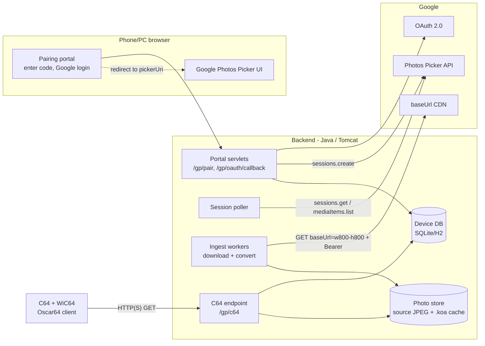

# Feasibility Study: Turning ImageViewer into a Google Photos Viewer for the C64 + WiC64

*Status: decisions recorded (see §10), prior art reviewed (§3.4) · Date: 2026-09-30*
*Input: Google Doc "C64 Wic64 Google Photos viewer" (EN) / "C64 WiC64 Google Photos Viewer" (CZ original with sources), this repository, and public documentation checked on the date above.*

---

## 1. Verdict

**Feasible. Risk is moderate, and almost all of it is on the Google side, not the C64 side.**

| Area | Feasibility | Comment |
|---|---|---|
| C64 display and transfer (Koala multicolor / Hi-Eddi hires over WiC64) | ✅ Already solved | This repo already does it. The research doc's memory layout matches `basic/imageviewer.bas` byte for byte. |
| Image conversion (JPEG → VIC-II) | ✅ Already solved | Petsciiator's `KoalaConverter` / `HiEddiConverter` are already wired into `ImageViewerService`. |
| Backend access to Google Photos | ⚠️ Feasible with constraints | The **only official path open to hobby projects is the Picker API**: the user picks photos on a phone or PC. Auto-updating sources such as "Favorites" are only available through the partner-only Ambient API. An **unofficial public shared-album link** gives auto-updating albums without OAuth. See §3.4–3.5 for how other viewers do it. |
| Google OAuth app status | ⚠️ Policy risk | Personal/family use works in "Testing" mode (≤100 test users). A public service needs Google OAuth verification. |
| New C64 client in Oscar64 | ✅ Feasible, moderate effort | No official Oscar64 WiC64 binding exists, so a small driver is needed (options in §7.3). |
| Hosting | ⚠️ New requirement | OAuth needs a public HTTPS domain. You can't rely on the original author's `jpct.de` server. |

**You were right that the backend is the main work.** It needs new subsystems: pairing, OAuth, Picker sessions, an ingest queue and persistent storage. The C64 side is largely a rewrite of a known-good design in a nicer language.

**Rough effort** (one hobby developer who knows Java, see §8):

| Scope | Estimate |
|---|---|
| Proof of concept with the existing BASIC client unchanged | 4–6 days |
| Full backend | 10–17 days |
| Oscar64 client | 9–15 days |

---

## 2. What exists today (and what can be reused)

```
C64 (MOSpeed-compiled BASIC + inline asm, basic/imageviewer.bas)
  │  WiC64 legacy "W" protocol via res/universal.prg at $C000
  │  HTTP GET  <server>/ImageViewer?file=<url|search|ai:prompt>&dither=50&hi=1&ar=true
  ▼
Java servlet (ImageViewer.java → ImageViewerService.java), Tomcat, Java 11
  ├─ input type detection: image URL / page URL / PDF / Google image search / ai: prompt
  ├─ download → Petsciiator KoalaConverter | HiEddiConverter → .koa bytes
  ├─ in-memory caches: ImageCache (20 min), URL_SHORTENER (2000), AI_REQUEST_CACHE
  └─ wire protocol (first 2 bytes of the response decide):
        $00 $60 …  → image (Koala, loaded to $5FFE so bitmap lands at $6000)
        $00 $00 "ERROR: …"  → error text
        $01 $01 [len,bytes]… $00  → list of up to 22 image references
```

| Existing piece | Reuse for Google Photos | Notes |
|---|---|---|
| `KoalaConverter` / `HiEddiConverter` (Petsciiator) | **As is** | They take a local file path. We download the Google photo to a temp file and call the same code. |
| `ImageViewer` servlet + wire protocol | **Extend** | Add a `gp:` input mode next to `ai:` (see `UrlUtils.isAiPrompt`), or add a dedicated servlet. |
| `ImageCache`, `Blob` | **Extend** | They are in memory with a 20-minute TTL. Google Photos needs a persistent on-disk cache (§6.5). |
| `URL_SHORTENER` + list protocol (`$01 $01`) | **Reuse for the PoC** | Google `baseUrl`s are far over 170 chars and already need shortening. The list format gives prev/next browsing and slideshow for free. |
| `basic/imageviewer.bas` | **Reuse for the PoC** | It already has CRSR-left/right browsing, a slideshow (keys 1–9), dithering, hires/multicolor and "save as Koala" to disk. |
| `Config` (`/webdata/imageviewer/apikey.ini`) | **Extend** | Add the OAuth client id/secret, public base URL and storage path. |
| Hard-coded `https://jpct.de/…` (shortener, `ipgetiv.php`) | **Must change** | These point at the original author's (EgonOlsen71) infrastructure. A fork needs its own host (§6.8). |

**Build note:** `petsciiator` and `basicv2` are not on Maven Central. They must be built and `mvn install`ed from EgonOlsen71's repositories first, as the README says.

---

## 3. Review of the research document

The research is solid on hardware and on Google's policy change. The points below confirm, correct or extend it.

### 3.1 Confirmed

* **Library API scopes are gone.** Since 2025-03-31 `photoslibrary.readonly` and similar return 403. The **Picker API** (`photospicker.mediaitems.readonly`) is the only general-purpose read path.
* **The Picker flow:** `sessions.create` → user opens `pickerUri` → poll `sessions.get` until `mediaItemsSet` → `mediaItems.list` → `sessions.delete`. Polling should follow the returned `pollingConfig` (`pollInterval`, `timeoutIn`).
* **`baseUrl` lives for 60 minutes**, so everything has to be downloaded right after picking.
* **WiC64 is fast enough.** It moves about 20 kB/s, so a 10,003-byte Koala image takes about 0.5 s. Firmware 2.x / wic64-library supports the `R`/`E` protocols, `%mac`, `%ser` and `!` URL expansion, and `WIC64_GET_STATUS_MESSAGE`.
* **The Koala layout and VIC bank 1 setup** (`$DD00`=…10, `$D018`=`$78`, screen `$5C00`, bitmap `$6000`, colour data from `$8328` → `$D800`, background at `$8710`) are exactly what `imageviewer.bas` lines 52008–52090 do today.

### 3.2 Corrections and additions

| # | Research doc says | Finding | Impact |
|---|---|---|---|
| 1 | Device Authorization Grant (RFC 8628) "does not solve this alone" | Stronger than that: the Picker scope is **not on the device-flow scope allow-list**, so it can't be used there at all. | Use the normal web OAuth code flow + PKCE on the user's phone or PC. Pairing by code is still the right UX. |
| 2 | `baseUrl` can't be stored long term, which prevents fetching from the C64 | Also: **every `baseUrl` request needs an `Authorization: Bearer` header**, and you must add size (`=wW-hH`) or download (`=d`) parameters. | The C64/WiC64 could never fetch Google directly. A server proxy is mandatory, not just convenient. |
| 3 | Backend in Node.js / Python / Go | The existing backend is Java and already has a tested VIC-II converter, caching and the C64 protocol. | **Stay on Java.** Rewriting the converter (OKLab k-means etc.) is optional polish, not a prerequisite. |
| 4 | Store OAuth refresh tokens in a DB encrypted with AES-256-GCM | The Picker model needs a human in the loop for every new batch anyway. The token is only needed during picking and ingest (under an hour). | **Don't store refresh tokens at all.** Keep the access token in memory for the ingest and then drop it. This removes a whole security surface, and Testing mode's 7-day token expiry stops mattering. |
| 5 | `/api/photo/next` returns exactly 10,003 B | Errors and status also have to go through the same GET. With the `R` protocol the client learns the response size before the payload. | Keep the existing 2-byte discriminator (`$00 $60` image, `$00 $00` error, `$01 $01` list). The client checks the size before accepting a payload. |
| 6 | `POST /api/photo/control` | The legacy `W` protocol used today has no reliable POST, and GET with query parameters is enough. | **GET only.** Use stateless indices (`?i=17`) instead of server-side "next", so prev/next/resume work without extra calls. |
| 7 | Device identity = WiC64 MAC via `%mac` | The MAC is not a secret: anyone who knows it could fetch a family's photos. | Pairing issues a random **device token**. The client saves it to disk and sends it with every request, with the MAC as an extra check. |
| 8 | Staging buffer in bank 0 `$2000–$4712` | That clashes with where an Oscar64 program lives. | See the memory map in §7.2. Double buffering banks 1 and 2 gives a seamless slideshow. |
| 9 | Pairing code typed into a portal; QR shown as an optional extra | The QR code can **carry the pairing code** (`https://<host>/p/<code>`). One scan starts the whole login → pick flow, with no typing. The server already renders images. | **QR-triggered auth is the primary path** (§4.2). **"Everything is an image":** the server renders the pairing screen (QR + code + URL) as a hires bitmap. The C64 needs no QR or text-layout code, and this even works with the old BASIC client. |
| 10 | Crop to 4:3, then Lanczos to 160×200 | Google can resize and centre-crop on its side (`=w320-h200-c`). | For the "keep aspect ratio" option and later re-conversion, store a medium source (for example `=w800-h800`, fit-inside) and let Petsciiator crop or letterbox. |

### 3.3 New findings not in the research doc

* **Google Photos Ambient API** (`photosambient.mediaitems`) is built for TVs and photo frames. It gives curated, auto-updating slideshows with no per-batch picking, but it is **only for approved partners**. It's worth an "expression of interest" later, but don't plan on it.
* **OAuth app status.** In "Testing" mode, test users' authorisations expire after 7 days and the app is limited to 100 test users. That's fine for personal or family use, especially with correction #4. Going public needs Google OAuth verification, a privacy policy and a verified domain, which typically takes weeks.
* **Prior art.** [huysmki/wic64-server](https://github.com/huysmki/wic64-server) (MIT) serves local photos as multicolor to a WiC64 client written in 6502 assembly. It uses the official wic64-library, per-cell palette search and Floyd-Steinberg dithering. It's a useful reference for protocol and quality, but it has no Google integration.
* **C WiC64 driver prior art.** [SM7I/WIC64-CC65](https://github.com/SM7I/WIC64-CC65) is pure C with peek/poke and no cc65-specific syntax, so it's a likely starting point for an Oscar64 port.
* **Emulator.** VICE 3.8+ emulates the WiC64, so most client development can happen without real hardware. Its coverage of the firmware 2.x `R` protocol still needs checking.

### 3.4 How other Google Photos viewers are built (2025–2026)

After Google removed library-wide read access on 2025-03-31, every DIY and commercial viewer I checked uses one of the patterns below.

| # | Pattern | Who uses it | Official? | Auto-updating? | Favorites? | Setup |
|---|---|---|---|---|---|---|
| A | **Picker API import:** the user picks items in Google's picker; the server downloads within 60 min and keeps its own copy | [esp32-photoframe-server](https://github.com/aitjcize/esp32-photoframe-server) (ESP32 e-paper frames), [ha_google_photos_album](https://github.com/OldPhoneKiosk/ha_google_photos_album) (Home Assistant) | ✅ | ❌, re-pick to add | Manually: the picker has no Favorites/Albums tabs, but the user can **search** (album titles, dates, places, things) and multi-select | Google Cloud project + OAuth (Testing mode fine) |
| B | **Ambient API:** the device is registered via the API; the user chooses sources in the Google Photos app; the server lists that device's items | Aura frames, Google's own Nest Hub / Chromecast ambient mode | ✅ | ✅ | ✅ **Albums, Favorites, people & pets, Recent highlights** (same source choices as Google's own photo-frame devices; confirm when accepted) | **Partner programme only** ("express interest", no public criteria) |
| C | **Public shared-album link scraping:** fetch `photos.app.goo.gl/…`, pull `lh3.googleusercontent.com` URLs out of the page's embedded JSON, resize with `=wW-hH` | [google-photos-album-image-url-fetch](https://www.npmjs.com/package/google-photos-album-image-url-fetch), home dashboards like [kishore280/home](https://github.com/kishore280/home/pull/47) and [brotherlogic/rose](https://github.com/brotherlogic/rose/issues/82) | ❌ undocumented | ✅, the album is re-read on a schedule | Only if favorites are added to a shared album. **Live albums** (auto-add chosen people/pets) keep updating themselves | None: no OAuth, no Google Cloud project |
| D | **Leave Google:** move the library to Immich or Synology Photos (e.g. via a Takeout import) and use their APIs | [ImmichFrame](https://github.com/immichFrame/ImmichFrame), esp32-photoframe-server (Immich/Synology sources) | ✅ (their APIs) | ✅ | ✅ native favorites and albums | Self-hosted photo server |
| — | *Dead ends* | `photoslibrary.readonly` projects such as [frameoff](https://github.com/hellodelay/frameoff) (still documents the removed scope), [mrworf/photoframe](https://github.com/mrworf/photoframe) (dropped Google), [MMM-GooglePhotos](https://github.com/hermanho/MMM-GooglePhotos) (broken since 2025-03) | | | | Library API readonly scopes return 403. Library API favorites filters now only see app-uploaded items. The Data Portability API reportedly has no Photos resource group (Google Photos isn't a DMA core service; verify). Takeout exports the whole library every two months at most. |

**Validation of our design:** esp32-photoframe-server is almost exactly this project with an e-paper panel instead of a C64. It imports through the Picker, crops and dithers per device palette, and serves each device a ready image through a revocable bearer token. Ideas worth borrowing from it: several **photo sources behind one device endpoint**; a **"smart collage"** (it pairs two photos that don't fit the screen; for the C64's landscape screen we'd put **two portrait photos side by side**); and an optional **date overlay**.

### 3.5 So what about "Favorites"?

The Picker isn't technically the only way, but it's the only official way available to a hobby project. The honest options:

| Want | Best available route |
|---|---|
| Favorites, **auto-updating**, official | **Ambient API** (pattern B). It's the right technical fit and our backend could add it as one more source. It depends on Google accepting the project into the partner programme; expressing interest costs nothing. |
| Favorites, official, **one-time or occasional** | **Picker** (pattern A). The Picker has no Favorites concept at all: `sessions.create` takes no filter (only `maxItemCount`), the returned `PickedMediaItem` has no favorite flag, and the picker UI opens on recent photos with no Favorites/Albums tabs, only search. Most reliable workaround: keep an album (for example "C64") of your favorites, search its title in the picker and multi-select. Our portal should tell the user this before redirecting. The user adds favorites through search and multi-select; "Pick more" appends new ones. **To verify in the spike:** whether the picker's search finds "Favorites" directly, whether whole days can be selected at once, and whether media item ids stay stable (for dedupe). |
| Any album, **auto-updating**, no Google Cloud setup | **Shared-album link** (pattern C). In the Google Photos app, select favorites → "Add to album" → share by link. For people or pets, a **live album** fills itself. New favorites still have to be added to the album by hand. Unofficial and can break without notice. |
| Everything, including favorites, native | **Immich** (pattern D). It only makes sense if you're willing to move your library off Google Photos. |

---

## 4. Target architecture



### 4.1 End-to-end user flow

1. **C64:** the first start (or no device token on disk) calls `GET /gp/c64?op=pair&mac=%mac`.
2. **Server:** creates a device record with a one-time pairing code (for example `7K9QXM`, valid for 10 minutes) and a device token. It returns the token plus a **bitmap** with a big **QR code** encoding `https://<host>/p/7K9QXM`, and the same code and URL as text for people without a camera. The C64 saves the token to disk and shows the bitmap.
3. **Phone:** the user **scans the QR code**, which lands straight on Google sign-in with no typing. The pairing code in the URL becomes the OAuth `state` (with PKCE, scope `photospicker.mediaitems.readonly`). After consent the callback creates the Picker session and redirects to `pickerUri` + `/autoclose`. Scan once, log in, tap photos, done.
4. **Server:** polls `sessions.get` in the background, following `pollingConfig`. Once `mediaItemsSet` is true, it pages through `mediaItems.list`, queues all `PHOTO` items and deletes the session.
5. **Ingest:** workers download each item with the Bearer token within the 60-minute window, store a medium JPEG and pre-convert the default variant (multicolor, 50% dither) to `.koa`. The access token is thrown away afterwards.
6. **C64:** polls `op=status` and shows progress ("123 / 480 photos ready"). It then runs the slideshow with `op=img&i=<n>&mode=mc&dither=50`.
7. **New photos later:** the user presses "Pick more" on the portal (or `P` on the C64, which shows a new pairing screen). That starts a new Picker session, with new items appended or replacing the old set. **Re-picking is the one UX compromise Google imposes.**

### 4.2 QR-code-triggered authentication

The QR code is how you start the login. It doesn't replace Google's login, and it doesn't need the device flow:

* **Why it works:** OAuth still runs as a normal web auth-code flow in the phone's browser, which the Picker scope allows. The QR code only carries the one-time pairing code, so the phone session knows which C64 it belongs to. This is the same "scan to sign in" pattern smart TVs use. The only difference is that our server does the linking, because Google's device flow doesn't allow the Picker scope.
* **Security:** the code is single-use, lasts 10 minutes and is bound to the device token. After a scan the C64 screen changes to "waiting for photo selection…", so a photographed QR code is useless afterwards. If a second person scans an unused code, the worst case is that they link *their own* photos to your C64. They can't reach yours.
* **Fits on the C64 screen:** `https://host.tld/p/7K9QXM` (~26 chars) is a version 2–3 QR code (25–29 modules). Rendered **hires** (pure black/white, the sharpest option), 5×5 pixels per module plus a 4-module quiet zone is about 185×185 px, which fits in 320×200 next to the text. Phone cameras read it reliably from a CRT or LCD. Text mode also works: PETSCII quarter-block characters give 80×50 "pixels", enough for version 3. The server can send that as 1,000 screen codes.
* **Rendered on the server:** ZXing (Java) builds the QR code, and the existing `HiEddiConverter` or a direct 1-bit bitmap writer turns it into C64 data. The client needs no QR code at all, so this works with the unchanged BASIC client in Phase 1 too.
* **"Pick more" works the same way:** pressing `P` on the C64 shows a fresh QR code. You scan it and add photos, and because you're usually still signed in to Google, it's two taps.

---

## 5. Google Cloud and policy setup

| Step | Detail |
|---|---|
| GCP project | Enable **Google Photos Picker API**. |
| OAuth consent screen | External; scope `…/auth/photospicker.mediaitems.readonly`. Start in **Testing** and add your Google accounts as test users (max 100). |
| OAuth client | Type "Web application". The redirect URI `https://<host>/gp/oauth/callback` must be HTTPS on a real domain (localhost is allowed only for development). |
| Production (optional) | Only needed to go beyond test users or to remove the "unverified app" screen. Requires Google verification, a privacy policy and domain ownership. Plan weeks, not days. |
| Terms | **To verify:** the Google Photos API terms on caching/storing user media. The design keeps derived C64 renditions per user, deletes them on unpair or after inactivity, and shares nothing. For personal use the risk is low. Review it before offering this publicly. |

---

## 6. Backend design (the main work)

### 6.1 Technology choice

**Recommendation: extend the existing Java 11 WAR.** Moving to Java 17+ is optional.

* It reuses Petsciiator conversion, `ImageViewerService` error handling, the C64 wire format and the Tomcat deployment.
* It needs no Google client library: a few JSON REST calls with `java.net.http.HttpClient` + Jackson (already a dependency).
* The alternative (a Node/Python/Go rewrite) would mean re-implementing or shelling out to the converter for no functional gain.

### 6.2 New components

| Component | Responsibility | Approx. size |
|---|---|---|
| `GooglePhotosConfig` | OAuth client id/secret, public base URL, storage path (extends `Config`) | S |
| `PairingServlet` (`/p/<code>` from the QR, `/gp/pair` for manual entry) | Validates the one-time code, starts OAuth with a PKCE verifier + `state` bound to the device | M |
| `OAuthCallbackServlet` (`/gp/oauth/callback`) | Exchanges the code for an access token, calls `sessions.create`, redirects to `pickerUri + "/autoclose"`, shows a "done, look at your C64" page | M |
| `PickerSessionPoller` | Scheduled executor that polls `sessions.get` per `pollingConfig`, then `mediaItems.list` (paged), then `sessions.delete` | M |
| `IngestService` | Bounded thread pool (for example 4) that downloads `baseUrl=w800-h800` with the Bearer token, saves the source, pre-converts the default `.koa`, and records progress and errors | M |
| `DeviceStore` | Devices, pairing codes, items (id, order, status, timestamps). Use SQLite or H2 (embedded, zero-ops) | M |
| `PhotoStore` | Filesystem layout `store/<deviceId>/<n>.jpg` and `…/<n>_<mode>_<dither>_<ar>.koa`; converts lazily for non-default variants | S |
| `C64Servlet` (`/gp/c64`) | The only endpoint the C64 talks to (§6.3) | M |
| `ScreenRenderer` | Renders pairing, progress and error screens (text + QR via ZXing) to a `BufferedImage`, then through the same converter to `.koa` | S–M |
| Housekeeping | Expire unused pairing codes, remove devices idle for >N days, cap photos per device (for example 2000) and disk quota | S |

### 6.3 C64 wire protocol

All requests are `GET` so they work with legacy and current WiC64 protocols. All responses use the existing 2-byte discriminator:

| Request | Response |
|---|---|
| `op=pair&mac=%mac` | `$03 $01` + 16-byte device token, followed by a pairing-screen Koala (or two calls: token, then screen) |
| `op=status&t=<token>` | `$02 $01` + fixed struct: state (0=unpaired, 1=picking, 2=ingesting, 3=ready), `total` (u16), `ready` (u16) |
| `op=img&t=<token>&i=<n>&mode=mc\|hi&dither=0..100&ar=0\|1` | `$00 $60` + Koala (10,003 B incl. header) or Hi-Eddi. `i` wraps modulo `total`. |
| `op=screen&t=<token>&s=status` | Server-rendered status bitmap (progress bar, "press P to pick more") |
| `op=info&t=<token>&i=<n>` | `$02 $02` + fixed record: position (u16), total (u16), date `YYYY-MM-DD`, file name (≤ 32 chars, PETSCII-safe) |
| `op=unpair&t=<token>` | Deletes the device's data; returns `$02 $01` status |
| any error | `$00 $00` + `"ERROR: <text>"` (existing format) |

Rules: responses have a fixed maximum size (≤ 10,003 B, or ≤ 9,218 B for hires). The client refuses anything bigger, based on the `R`-protocol size header. Pixels are never sent before the header.

### 6.4 Ingest throughput check

2,000 photos (the Picker maximum per session) must be downloaded within 60 minutes. A medium-size fetch (~80–150 KB) takes about 0.2–0.5 s. With 4 parallel workers, 2,000 items take about 3–5 minutes to download. Conversion runs separately and can take its time, because the stored source doesn't expire. **Comfortably feasible.** Only the download has to finish within the hour; conversion can run lazily.

### 6.5 Storage estimate

Per 1,000 photos: ~100 MB of source JPEG + ~10 MB of `.koa` per variant. A small VPS disk is enough. Delete everything on unpair.

### 6.6 Security

* The device token (128-bit random) is the credential on every C64 request. The MAC is only a secondary check.
* Use HTTPS for the portal. For the C64 endpoint, HTTPS is recommended (the ESP32 does TLS). Plain HTTP is acceptable only with the token and short-lived images.
* Keep no refresh tokens, and keep access tokens only in memory during an ingest.
* Rate-limit `op=pair` and code entry. Codes are single-use and short-lived.
* The existing servlet's path checks (`..`, `\`) stay. Photo ids never map directly to file paths.

**What survives a power cycle:**

| Event | Effect |
|---|---|
| C64 switched off and on | Nothing lost. The client reads the device token from its disk file and continues where the slideshow left off (the last index can be saved too). No QR code, no Google login. |
| Server restarted | Nothing lost. Devices, photo lists and converted images live in SQLite/H2 + the file store (the Phase 1 PoC keeps state in memory and doesn't survive this). |
| C64 booted without its disk (different disk, loaded from the network) | The token is gone, so the C64 shows a QR code again. **Re-pairing only reconnects:** photos belong to the portal account, not the token. After the scan the portal offers "reconnect this C64 to your existing photos" (it matches the MAC), with no re-picking. |
| Adding photos | Needs Google sign-in on the phone every time, because the Picker is interactive. The phone's browser usually remembers the Google login, so it's scan → consent → pick. Testing mode's 7-day expiry doesn't matter because nothing on the server depends on a stored Google token. |
| Access revoked in the Google account | Already-imported photos keep working until the user removes them on the portal or unpairs. The next "Pick more" asks for consent again. |

### 6.7 Photo sources (applying §3.4)

The ingest, store, conversion and C64 protocol don't care where a photo came from. Make this explicit with a small `PhotoSource` interface, so a device can have several sources attached and the C64 shows their combined list.

| Source | Status | Refresh | Needs | Effort |
|---|---|---|---|---|
| `PickerSource` | **Core** (official) | On user action ("Pick more", QR) | OAuth, Google Cloud project | in the §8 estimates |
| `SharedAlbumSource` | **Experimental, personal builds only** | Re-read every N hours; new photos are ingested, removed ones dropped | Only the album link (it's a secret: anyone with it sees the album) | 2–3 days, incl. pagination beyond the first ~300 items via the page's continuation token |
| `AmbientSource` | **Future**, only if accepted as a partner | Continuous, sources chosen in the Google Photos app | Partner approval, scope `photosambient.mediaitems` | ~3–5 days once approved |
| `ImmichSource` | Optional | Continuous; albums and `isFavorite` via Immich API | A self-hosted Immich + API key | ~2 days |

Rules that follow from this:
* **Items are keyed by `(source, sourceItemId)`.** Dedupe and "Append" work the same way for every source.
* **The shared-album parser is fragile by nature.** It should find URLs by pattern rather than fixed JSON positions, fail softly (keep the last good list, show "album could not be refreshed" on the status screen), and be switchable off in config. Because of ToS and stability it stays out of any public release (§10, decision 1).
* **The pairing QR code stays the same for every source.** It links the C64 to a portal account; the portal page then offers "Pick photos in Google Photos" and "Add a shared album link".
* **Portrait photos:** the conversion step gets an optional "two portraits side by side" layout (from esp32-photoframe-server's smart collage), next to crop and letterbox.

### 6.8 Hosting

It needs a public HTTPS domain. Options, in order of simplicity:

1. **A small VPS** (Tomcat + Let's Encrypt). This matches the current deployment model.
2. **A home server** behind a reverse proxy or tunnel (for example Cloudflare Tunnel).
3. **A container on Cloud Run / Fly.io.** This works, but needs a persistent volume or bucket for the store.

The C64 client should hard-code the backend URL, as the research doc recommends (avoid `WIC64_SET_SERVER` NVS writes). Alternatively it can use a tiny discovery file like the current `ipgetiv.php`, hosted on your own domain.

---

## 7. C64 client in Oscar64

### 7.1 Why rewrite (and why not yet)

The current MOSpeed-compiled BASIC client works and could drive the proof of concept unchanged (§8, Phase 1). Oscar64 (C99 + large parts of C++, native 6502 code generation, `__asm`, `__interrupt`, `#pragma region`, `#embed`) brings:

* a real state machine with non-blocking input and an IRQ/CIA-timer driven slideshow;
* **double buffering**: load the next image into the hidden VIC bank while the current one is shown, then flip in one frame, with no blanking;
* the `R` protocol with status messages, proper timeouts and response-size checks;
* maintainable C code instead of BASIC with inline asm in REM lines.

### 7.2 Proposed memory map

| Range | Use |
|---|---|
| `$0801–$3FFF` | BASIC stub + Oscar64 code/data (~14 KB; client estimated at 6–12 KB) |
| `$4000–$5BFF` | More code/data/heap (Oscar64 `#pragma region`) |
| `$5C00–$5FE7` | **Buffer A** screen RAM (VIC bank 1) |
| `$5FFE–$8711` | **Buffer A** Koala receive: bitmap `$6000–$7F3F`, screen staging `$7F40`, colour staging `$8328`, background `$8710` |
| `$8712–$9BFF` | Heap / disk buffer |
| `$9C00–$9FE7` | **Buffer B** screen RAM (VIC bank 2) |
| `$9FFE–$C711` | **Buffer B** Koala receive: bitmap `$A000–$BF3F` (under BASIC ROM, which Oscar64 banks out), staging `$BF40–$C711` |
| `$C712–$CFFF` | WiC64 driver (if kept as a separate binary) / stack |

Colour RAM (`$D800`) can't be double-buffered. Its 1,000-byte copy (an unrolled loop, under half a frame) runs at the flip, synchronised to the raster.

### 7.3 WiC64 driver options

| Option | Pros | Cons | Recommendation |
|---|---|---|---|
| **A.** Assemble the official **wic64-library** (ACME, BSD) at a fixed address, `#embed` it, call through a small `__asm` wrapper | Official, firmware-2 `R`/`E` protocols, `%mac`, status messages, timeouts | Two toolchains (ACME + Oscar64); fixed-address glue | **Preferred** |
| **B.** Port **SM7I/WIC64-CC65** (pure C) to Oscar64 | One language and toolchain | Unofficial; check its licence and protocol version; handshake speed in C must be measured | Fallback |
| **C.** Reuse `basic/res/universal.prg` at `$C000` (current jump table `$C000/$C003/$C012/$C015/$C018`) | Zero effort, proven in this project | Legacy `W` protocol (deprecated), no size header | Only for the BASIC-based PoC (firmware 2.0+ decided, §10) |

### 7.4 Client state machine

```
BOOT → detect WiC64 → load token from disk
   ├─ no token → PAIR  (fetch & show pairing bitmap, poll status every 5 s)
   └─ token    → STATUS
STATUS: unpaired → PAIR │ picking/ingesting → show progress bitmap, poll │ ready → SHOW(i)
SHOW(i): flip to preloaded buffer, start timer, preload i+1 into hidden buffer
   keys: SPACE/→/fire next · ← prev · 1–9 delay · M mc/hires · D dither · A aspect
         I photo info · S save to disk (Koala/Hi-Eddi) · P pick more (append)
         RUN/STOP exit
errors: show text from WIC64_GET_STATUS_MESSAGE / server "ERROR:", retry with back-off
```

### 7.5 Build and test

* Oscar64 builds on Linux, macOS and Windows. The `.prg` can be packed onto a `.d64` with `c1541` from VICE (replacing the current Windows-only `basic/build/build.cmd`).
* Develop against VICE 3.8+ WiC64 emulation. Final testing on real hardware is still needed, because timing and firmware versions differ.

---

## 8. Phased plan and effort

The estimates are working days for one developer who knows Java and has some C/6502 experience. They include testing, but not waiting on Google verification.

| Phase | Content | Days | Exit criterion |
|---|---|---|---|
| **0. Spike** | GCP project, Testing consent, manual Picker session with curl/Java, download one `baseUrl` with Bearer, convert with Petsciiator. Check the picker questions from §3.5 (Favorites search, select-by-day, stable ids). Try parsing one of your shared-album links. | 1–2 | One of your photos shows on the C64 via a hard-coded path |
| **1. PoC with the existing BASIC client** | `gp:<token>` input mode in `ImageViewerService`; pairing portal + OAuth + Picker + ingest (in-memory/files); return the photo list through the existing `$01 $01` list protocol (22 per page) | 3–4 | Pick 20 photos on a phone → browse them / slideshow on the C64 with **no client change** |
| **2. Backend proper** | `C64Servlet` protocol, `PhotoSource` interface, SQLite/H2 store, persistent cache, `ScreenRenderer` (pairing QR), housekeeping, security, deployment on your own domain | 6–11 | Survives restarts, handles 2,000 photos, unpair deletes data |
| **3. Oscar64 client** | Driver (option A), display + double buffer, state machine, pairing/progress screens, hires/dither/aspect toggles, photo info, save-to-disk, `.d64` build | 9–15 | Seamless slideshow on real hardware; recovers from Wi-Fi drops |
| **2b. Extra sources (optional)** | `SharedAlbumSource` (auto-updating albums, personal builds), `ImmichSource` | 2–5 | A shared or live album refreshes on the C64 without re-picking |
| **4. Polish (optional)** | Better converter (OKLab, per-cell k-means, face-aware crop), portrait side-by-side layout, date overlay, Ambient API (if accepted), public release + OAuth verification | open | — |

**Total to a complete personal-use product (phases 0–3): about 19–32 days.** Public release (OAuth verification, privacy policy) comes on top and mostly means waiting for Google.

---

## 9. Risks and mitigations

| Risk | Likelihood | Impact | Mitigation |
|---|---|---|---|
| Google changes or restricts the Picker API further | Low–Med | High | `PhotoSource` interface (§6.7): the store, conversion and C64 protocol don't depend on the source, and other sources can take over. |
| Shared-album page format changes | High (over time) | Med (experimental source only) | Pattern-based parsing, keep the last good list, config switch, never in a public release. |
| Users expect "show my favorites / new photos automatically" | High | Med | Say clearly that picked photos are a curated set, and make "Pick more" one scan (P shows a QR). Offer shared/live albums (§6.7) for auto-updating in personal builds. Express interest in the Ambient API partner programme. |
| OAuth verification needed for public use | Med (if public) | Med | Stay personal/family in Testing mode (≤100 users). Plan verification separately if you want a public service. |
| 7-day expiry in Testing mode | Certain | Low | Not needed after ingest, because no refresh token is stored (correction #4). |
| Terms of Service on storing derived images | Low–Med | Med | Per-user storage only, deleted on unpair or inactivity. Review the terms before a public release. |
| No official Oscar64 WiC64 binding | Certain | Low–Med | Option A (embed the ACME-built library). Spike it early in Phase 3. |
| VICE WiC64 emulation differs from real hardware / firmware 2.x | Med | Low | Test on hardware at the end of each milestone. |
| Conversion quality on real-life photos (skin tones, portrait orientation) | Med | Med | Petsciiator already produces good results. Add face/centre-aware crop and a blurred letterbox for portrait photos as polish. |
| Dependency on EgonOlsen71's infrastructure (`jpct.de`) and unpublished Maven artefacts | Certain | Med | Self-host (§6.8), remove hard-coded hosts, build Petsciiator/basicv2 locally (or vendor them). |

---

## 10. Decisions

Agreed on 2026-09-30:

| # | Question | Decision | Consequences for the design |
|---|---|---|---|
| 1 | Audience | **Personal/family first, public later** | Start in OAuth **Testing** mode (≤100 accounts, no Google review). Build as if public from day one so verification later is paperwork, not a redesign: multi-user data model, per-user delete on unpair/"forget me", a privacy page on the portal, only the one Picker scope, no stored refresh tokens. Verification is a separate later step (§5). |
| 2 | Fork scope | **Dedicated Google Photos viewer** | The Oscar64 client is Photos-only: no URL, page, search, AI or PDF input. The existing `ImageViewer` servlet and `basic/imageviewer.bas` stay untouched in the repo. The new backend lives in the same WAR as new servlets (`/p/*`, `/gp/*`) and reuses `ImageViewerService`'s conversion code. The Phase 1 PoC may still use the BASIC client through a `gp:` mode as a throw-away test harness. |
| 3 | Hosting | **Not decided yet, so keep it hosting-neutral** | All host-specific values (public base URL, OAuth redirect, storage path, DB file) come from config or environment variables, not code. Storage is a plain directory + an embedded SQLite/H2 file, so a VPS, home server + tunnel, or a container with a volume all work. Nothing points at `jpct.de`. Hosting only has to be chosen before Phase 2 (§6.8) (OAuth needs the final HTTPS domain). |
| 4 | WiC64 firmware | **Firmware 2.0+ required** | Driver option A (official wic64-library, §7.3). Use the `R` protocol: the client checks the response size before accepting a payload, reports errors via `WIC64_GET_STATUS_MESSAGE`, and uses `%mac`. Option C (legacy `universal.prg`) is dropped except in the BASIC-based PoC. The client checks the firmware version at boot and shows "WiC64 firmware 2.0+ required". |
| 5 | "Pick more" behaviour | **Append** | New picks are added to the end of the set. Duplicates are skipped by Google media item id. **To verify in the spike:** that Picker ids stay the same across sessions; otherwise fall back to filename + create time. A "clear all photos" action is on the portal and behind a confirm key on the C64. The per-device cap (for example 2,000, configurable) drops the oldest photos first, and the portal warns before that happens. |
| 6 | C64 features at launch | **Hires toggle, dither/aspect options, save to disk, photo info** | See the variant caching and `op=info` changes below and in §6.3 and §7.4. |
| 7 | Next step | **Update the study only** | No implementation yet. When you're ready, the next step is the Phase 0 spike (§8). You'll need to create the Google Cloud project first. |
| 8 | Open: extra sources | **Not decided yet** | Include `SharedAlbumSource` in personal builds? Express interest in the Ambient API partner programme? (§3.5, §6.7) |

### 10.1 What the launch features mean for the design

* **Variants:** multicolor/hires × 5 dither levels × crop/keep-aspect gives up to 20 renditions per photo. Only the default (multicolor, 50%, crop) is converted during ingest. Other variants are converted on first request (~0.3–1 s) and cached on disk with LRU eviction. The client's preload of the next photo into the hidden buffer hides that delay in the slideshow.
* **Photo info:** ingest stores `createTime` and `mediaFile.filename` from `mediaItems.list`. A new `op=info&i=<n>` returns them as a small fixed-length text record. On the C64, key `I` switches to a text screen with date, file name and position (for example "17 / 480"), and any key goes back. This avoids drawing text into the bitmap.
* **Save to disk:** a port of the existing Koala save (`imageviewer.bas` lines 21000–21150) through the KERNAL `SAVE` routine. For hires the Hi-Eddi layout is saved. The file name defaults to the photo date (for example `pic 250714`), with a drive-number toggle as today.

---

## 11. Sources

* Research input: Google Docs "C64 Wic64 Google Photos viewer" / "C64 WiC64 Google Photos Viewer" (including its 29 cited sources)
* Google Photos Picker API – [sessions](https://developers.google.com/photos/picker/guides/sessions), [media items](https://developers.google.com/photos/picker/guides/media-items), [authorization scopes](https://developers.google.com/photos/overview/authorization), [Picker launch & Library API changes](https://developers.googleblog.com/en/google-photos-picker-api-launch-and-library-api-updates/)
* [Google Photos Ambient API](https://developers.google.com/photos/ambient/guides/about) and [partner programme](https://developers.google.com/photos/partner-program/overview)
* [OAuth 2.0 for TV and limited-input devices](https://developers.google.com/identity/protocols/oauth2/limited-input-device) (allowed scopes) and [Manage app audience](https://support.google.com/cloud/answer/15549945?hl=en) (Testing mode limits)
* [WiC64-Team/wic64-library](https://github.com/WiC64-Team/wic64-library), [WiC64-Team/wic64-firmware](https://github.com/WiC64-Team/wic64-firmware)
* [Oscar64 manual](https://github.com/drmortalwombat/oscar64/blob/main/oscar64.md)
* [SM7I/WIC64-CC65](https://github.com/SM7I/WIC64-CC65), [huysmki/wic64-server](https://github.com/huysmki/wic64-server)
* [VICE 3.8 release (WiC64 emulation)](https://csdb.dk/release/?id=238034&show=summary)
* Prior art (§3.4): [esp32-photoframe-server](https://github.com/aitjcize/esp32-photoframe-server), [ha_google_photos_album](https://github.com/OldPhoneKiosk/ha_google_photos_album), [ImmichFrame](https://github.com/immichFrame/ImmichFrame), [MMM-GooglePhotos](https://github.com/hermanho/MMM-GooglePhotos), [mrworf/photoframe](https://github.com/mrworf/photoframe), [frameoff](https://github.com/hellodelay/frameoff)
* Shared-album link parsing: [google-photos-album-image-url-fetch](https://www.npmjs.com/package/google-photos-album-image-url-fetch), [brotherlogic/rose pagination notes](https://github.com/brotherlogic/rose/issues/130); [Live albums](https://blog.google/products/photos/keep-your-favorite-photos-date-live-albums/)
* [Picker: what users see](https://developers.google.com/photos/picker/guides/picking-experience) (no Favorites/Albums tabs; search instead), [Ambient API media items](https://developers.google.com/photos/ambient/guides/media-items), [Data Portability API scopes](https://developers.google.com/data-portability/user-guide/scopes)
