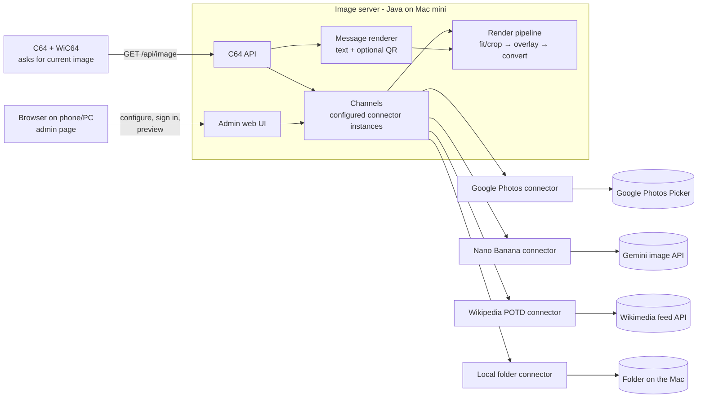

# Spec: C64 image server with connectors

*Status: draft v2 · Date: 2026-09-30 · Replaces the pairing and wire-protocol parts of [google-photos-feasibility.md](google-photos-feasibility.md) and [web-prototype-plan.md](web-prototype-plan.md)*

## 1. What changed from the earlier plan

| Before | Now |
|---|---|
| The C64 paired with the server (device token, QR code from the client flow) | **All authorisation happens on the server**, through its web admin page. The C64 has no login, token or pairing. |
| The server was a Google Photos viewer | The server is a **generic image server**. Google Photos is **one connector** among several, each with its own configuration. |
| The C64 asked for photo *n* | The C64 asks "what should I show now?" with its display settings, and gets **an image or "unchanged"**. The server decides what's current. |
| Errors were text (`ERROR: …`) | **Errors are images** with the message drawn into them. This proves the image path works even when a connector fails. |
| The C64 knew about photos, pairing and status | The C64 only knows the server's address, its display settings and how to show an image. |

Unchanged: no images are stored on the server except in RAM caches; the Java backend runs on your Mac mini; the image converter is Petsciiator; Google sign-in returns through the `ursiny.cz` relay page.

## 2. Architecture



**Terms used in this spec:**
* **Connector:** a type of image source (Google Photos, Nano Banana, Wikipedia picture of the day, local folder). It's code.
* **Channel:** a configured instance of a connector, with a name and its own settings. For example "family" (Google Photos), "today" (Nano Banana), "potd" (Wikipedia) and "scans" (local folder). You can have two channels of the same connector type, such as two folders.
* **Client:** a C64 (or the browser preview) asking for images.

## 3. Connector interface

Every connector implements the same small interface. The rest of the server doesn't know which one it's talking to.

```java
interface Connector {
    String type();                                // "google-photos", "nano-banana", "wikipedia-potd", "local-folder"
    void configure(ChannelConfig cfg);            // this channel's settings from the config file
    ConnectorStatus status();                     // OK | NEEDS_USER_ACTION(message, adminUrl) | ERROR(message)
    Item current(ClientCursor cursor);            // what this client should see now (may be the same as last time)
    Item step(ClientCursor cursor, int direction);// next/previous, for connectors with more than one item
    SourceImage load(Item item);                  // fetch the picture (bytes or BufferedImage) + caption, date, credit
    List<AdminAction> adminActions();             // e.g. "Sign in with Google", "Pick photos", "Generate now"
}
```

* `Item` has a stable `id`. The server uses it to answer "unchanged" and as a cache key.
* A connector reports trouble through `status()` or an exception. It never produces an error image itself; the server does that in one place (§8).
* Connectors that need a login implement their own flow behind admin routes (`/connectors/{channel}/…`). The rest of the server only sees `NEEDS_USER_ACTION`.

## 4. Configuration

One file on the Mac, for example `~/c64server/config.yaml`. Secrets stay in environment variables and are referenced as `${NAME}`.

```yaml
server:
  port: 8080
  publicBaseUrl: http://192.168.1.50:8080     # what QR codes and redirects point to
  adminPassword: ${ADMIN_PASSWORD}             # optional; LAN-only admin page otherwise
  defaultChannel: family

channels:
  family:
    type: google-photos
    interval: 60s                               # how long each photo stays
    order: shuffle                              # sequential | shuffle
    oauth:
      clientId: ${GOOGLE_CLIENT_ID}
      clientSecret: ${GOOGLE_CLIENT_SECRET}
      redirectUri: https://ursiny.cz/gp/callback.html

  today:
    type: nano-banana
    apiKey: ${GEMINI_API_KEY}
    model: gemini-2.5-flash-image               # or a newer/cheaper "Nano Banana" model
    schedule: ["07:00", "12:00", "18:00"]       # when to generate a new picture
    maxPerDay: 3                                # hard budget cap
    prompt: >
      A cosy {daypart} scene on {weekday}, {date}, in {season}.
      Bold shapes, few large areas of flat colour, high contrast.

  potd:
    type: wikipedia-potd
    language: en
    caption: true                               # draw the title into the image

  scans:
    type: local-folder
    path: /Users/michal/Pictures/C64
    recursive: true
    interval: 30s
    order: shuffle
```

Changing the file and restarting the server applies the change. Editing settings from the admin page is left for later.

## 5. Connectors

### 5.1 Google Photos (`google-photos`)

* **Source:** Google Photos Picker API. Photos you select in Google's picker (no folders and no Favorites tab; search an album name and select its photos).
* **Auth:** OAuth code flow + PKCE, started from the **admin page** ("Sign in with Google" → Google → `ursiny.cz` relay → server callback → "Pick photos" → picker). Scope `photospicker.mediaitems.readonly`. Needs the Google Cloud setup from [setup-guide.md](setup-guide.md).
* **State (RAM only):** access and refresh token, picker session id, photo list with image links (re-listed after 50 min).
* **Changes:** a new photo every `interval` per client. `nav=next/prev` steps manually.
* **Needs user action when:** not signed in yet; the picker session has expired (reportedly ~7 days); the refresh token is refused. The status becomes `NEEDS_USER_ACTION` and the C64 gets a message image with a QR code to this channel's admin page (§8).

### 5.2 Nano Banana generator (`nano-banana`)

* **Source:** Google's Gemini image model ("Nano Banana"). The model is configurable; current ids include `gemini-2.5-flash-image` and newer "Nano Banana 2 / 2 Lite" models (confirm the id and price when setting up).
* **Auth:** API key from Google AI Studio (`GEMINI_API_KEY`). No OAuth and no Google Cloud consent screen.
* **Prompt template placeholders:** `{date}`, `{time}`, `{weekday}`, `{month}`, `{year}`, `{season}`, `{daypart}` (morning/afternoon/evening/night). They're filled in at generation time, so the picture relates to "today".
* **Changes:** only on `schedule`. Client requests never trigger a generation; only the schedule and the admin "Generate now" button do. The latest picture stays in RAM until the next one (a restart costs one extra generation).
* **Cost:** roughly $0.03–0.07 per picture at 2026 list prices, depending on the model. Three per day is about $3–6 a month; hourly would be about $25–50 a month. `maxPerDay` is a hard cap.
* **Conversion tip:** prompts that ask for bold shapes, flat colour areas and high contrast survive the 16-colour C64 conversion much better. The config appends such a style hint.
* **Needs user action when:** the key is missing or refused, or the budget cap is reached (message: "Next picture at 18:00").

### 5.3 Wikipedia picture of the day (`wikipedia-potd`)

* **Source:** Wikimedia feed API, `https://api.wikimedia.org/feed/v1/wikipedia/{language}/featured/{YYYY}/{MM}/{DD}`. The server uses the `image` part: a thumbnail URL, title, description and credit.
* **Auth:** none. Requests must send a descriptive `User-Agent` with a contact address (Wikimedia's policy).
* **Changes:** once a day. Every other request answers "unchanged".
* **Special cases:**
  * Videos and animations: use the still thumbnail.
  * SVG: request the rendered PNG thumbnail.
  * Missing entry: fall back to yesterday's picture.
* **Credit:** most pictures are freely licensed but need attribution. The credit line goes on the info screen (§6.3), and optionally into the caption strip.

### 5.4 Local folder (`local-folder`)

* **Source:** image files in a folder on the Mac (JPEG, PNG, WebP, GIF). Ready-made C64 files (`.koa`) are passed through without conversion.
* **Auth:** none.
* **Changes:** a new file every `interval` per client. The folder is re-scanned every few minutes, so new files appear on their own.
* **Safety:** only files under the configured `path` are ever read (no path tricks from requests).
* This is the simplest connector, and the first one to build: it tests the whole pipeline with no external service.

### 5.5 Possible later connectors

The existing sources in this repo could become connectors: a single image URL, a Google image search, and the Ideogram/DALL-E prompt generators already in `IdeogramImageGenerator` and `DalleImageGenerator`. Others would fit the same interface, such as Immich or a webcam snapshot. None of these is in the first build.

## 6. C64 API

All requests are HTTP GET, so they work with the WiC64's plain HTTP GET command. No login is needed on your home network (§10).

### 6.1 `GET /api/image`

| Parameter | Values | Default | Meaning |
|---|---|---|---|
| `c` | `%mac` | the client's IP | Client id. The WiC64 replaces `%mac` with its MAC address. It keeps each C64's position separately; it isn't a secret. |
| `ch` | channel name | `server.defaultChannel` | Which channel to show |
| `mode` | `mc`, `hi` | `mc` | Multicolor (Koala) or hires (Hi-Eddi) |
| `dither` | `0`–`100` | `50` | Dithering strength |
| `ar` | `crop`, `fit` | `crop` | Fill the screen, or keep the whole picture with borders |
| `have` | image id | — | The id of the image currently on screen |
| `nav` | `next`, `prev` | — | Step manually instead of waiting for the interval |

The server works out the current item for this client and channel, and builds the image id from the item id plus `mode`, `dither` and `ar`. If that id equals `have`, it answers "unchanged". Otherwise it sends the image.

### 6.2 Response format

Every response starts with the same 10-byte header, so the client never has to guess what came back:

| Offset | Size | Field |
|---|---|---|
| 0 | 2 | Magic `C6` (`$43 $36`) |
| 2 | 1 | Version `$01` |
| 3 | 1 | Type: `$01` image, `$02` unchanged |
| 4 | 1 | Flags: bit 0 = message image (an error or a request for action), bit 1 = hires |
| 5 | 4 | Image id, 32-bit little endian |
| 9 | 1 | Next poll hint in units of 5 s (0 = client default) |

* **Image:** the header is followed by a standard C64 file: Koala (10,003 bytes including its `$6000` load address) or Hi-Eddi as written by Petsciiator's `HiEddiConverter`. Since the payload is a normal file, "save to disk" writes it unchanged.
* **Unchanged:** the header only.
* **Size check:** the whole response is at most header + Koala size. The client reads the length from the WiC64 before storing anything and rejects anything larger.
* **Poll hint:** tells the C64 when something can next change (the slideshow interval, the next Nano Banana run, midnight for Wikipedia). This saves pointless polling.

### 6.3 Other endpoints

| Endpoint | Returns | Used for |
|---|---|---|
| `GET /api/info?c=&ch=` | Fixed record: title (≤ 40 chars), date, credit (≤ 40 chars), position/total (0/0 if not applicable), channel name. PETSCII-safe text. | The C64's info screen (key `I`) |
| `GET /api/channels` | Count byte, then per channel: length byte + name + length byte + description | The C64's channel menu |
| `GET /api/image?…&raw=1` | The bare C64 file without the header | Testing with VICE or other tools |

## 7. The C64 client

What it does, in full:

1. **First run:** ask for the server address (for example `192.168.1.50:8080`) and save it to disk with the display settings. Later runs load it.
2. **Loop:**
   * Request `/api/image` with the settings and `have=<id on screen>`.
   * On "image", show it (double-buffered, see the study §7.2). On "unchanged", do nothing.
   * Wait for the poll hint, or for a key.
3. **Keys:**
   * Next/previous (sends `nav`).
   * Change channel (menu from `/api/channels`).
   * Toggle `mode`, `dither`, `ar`: the next request uses the new settings, the id changes, so a new rendering arrives.
   * `I` for the info screen.
   * `S` to save the current image to disk.
   * Change server address, and exit.
4. **Network or server not reachable:** this is the one case where the C64 has to show a message itself, because no image can arrive. It shows a short text ("Server 192.168.1.50 not reachable, retrying in 30 s"), using the WiC64 status message.

Everything else, including "sign in to Google Photos" and "budget used up", arrives as an image. The client knows nothing about connectors, Google or QR codes.

## 8. Message images (errors and requests for action)

When a channel can't deliver, the server still returns an **image**, flagged as a message:

| Situation | Message image shows | Poll hint |
|---|---|---|
| Connector needs the user (sign in, pick photos) | Channel name, one-line instruction, **QR code** to `publicBaseUrl/connectors/{channel}` | 30 s |
| Connector error (Google down, folder missing, API key refused) | Channel name and the error in plain words | 60 s |
| Nothing to show yet (empty folder, no photos picked) | What to do, and a QR code to the admin page | 30 s |
| Unknown channel | "No channel named …" and the list of channel names | client default |

* **How they're made:** the message renderer draws text (and the QR code, via ZXing) onto a 320×200 canvas. It then goes through the **same render pipeline and converter** as a photo, with the client's `mode`, so a visible message proves that conversion and transfer work.
* **If the converter itself fails:** the server returns a built-in, ready-made Koala file ("Server error, see server log"). It ships with the server as a resource, so something always reaches the C64.
* **QR code:** it's just a link to the admin page on the server. Authorisation happens there, on the server.

## 9. Render pipeline and caching

```
Connector.load(item) → SourceImage
  → prepare:  crop or fit to 320×200 (ar), optional two-portraits-side-by-side
  → overlay:  optional caption/date strip (per channel)
  → convert:  Petsciiator KoalaConverter / HiEddiConverter (mode, dither)
  → frame:    10-byte header + C64 file
```

* **Caches (RAM only, LRU):**
  * Converted images, keyed by image id (a few hundred KB).
  * Source lists per channel (photo lists, folder index).
  * The latest generated Nano Banana picture.
* **Nothing is written to disk** except temporary files for the converter, which are deleted immediately (the current Petsciiator API takes file paths). The local-folder connector reads your own files; it doesn't copy them.
* **A restart loses:** the caches, Google tokens (so it needs a new sign-in) and the Nano Banana picture (so one extra generation).

## 10. Admin web UI and security

* **Admin page** (`/`): a list of channels with their status (OK / needs action / error), and a preview of each channel's current image, both the original and the C64 rendering (this replaces the earlier "virtual C64" page). Per-connector actions include "Sign in with Google", "Pick photos" and "Generate now". It also shows the Google session and budget counters.
* **Network:**
  * The server listens on your home network.
  * The C64 API needs no login. It only returns images, and it can't trigger costly work (Nano Banana runs only on its schedule).
  * The admin page can be protected with `adminPassword`. Google sign-in and "Generate now" live there.
* **Secrets:**
  * OAuth client secret, Gemini key and admin password live only in environment variables.
  * Google tokens live only in RAM.
  * The relay page on `ursiny.cz` only forwards the one-time code, to a hard-coded address.
* **Later, if the server is ever exposed to the internet:** add an API key parameter for `/api/*`, HTTPS, and a real login for the admin page.

## 11. What happens to the existing code

* The old `ImageViewer` servlet and the BASIC client stay as they are and keep working.
* The new server lives in a new package (`com.sixtyfour.c64server` or similar), in the same repository and build. It reuses Petsciiator conversion and, later, the existing generators as connectors.
* The Oscar64 C64 client is simpler than in the earlier plan: no pairing, no status states, no QR code, just show whatever arrives.

## 12. Build order (prototype)

| Step | Content | Days |
|---|---|---|
| 1 | Server core: config loader, channel registry, render pipeline, message renderer + built-in fallback image, `/api/image` with header and "unchanged", per-client position, `raw=1` | 2–2.5 |
| 2 | **Local folder** connector and the admin page with previews. The whole path works without any external service. | 1–1.5 |
| 3 | **Wikipedia picture of the day** connector | 0.5–1 |
| 4 | **Google Photos** connector: OAuth via admin page + relay, picker, re-listing, `NEEDS_USER_ACTION` with QR | 2 |
| 5 | **Nano Banana** connector: prompt template, schedule, budget cap, "Generate now" | 1 |
| **Total server** | | **6.5–8** |
| 6 | Oscar64 C64 client: server-address prompt, settings, poll loop, double buffer, keys, info and channel menu, save to disk | 6–9 |

Steps 3–5 are independent and can be built in any order after step 2.

## 13. Open questions

1. **Several C64s:** is one position per client enough, or should a channel show the same image on every C64 at the same time (a shared clock)? The spec gives each client its own position, which covers both one C64 and several.
2. **Mixing channels:** should one "playlist" channel combine others (e.g. photos all day, the Wikipedia picture every morning)? The interface allows it later without changing the C64 API.
3. **Caption strip:** should captions be drawn into the picture by default, or only shown on the info screen? The spec leaves it per channel, off by default.
4. **Nano Banana model and price:** confirm the current model id and per-image price when creating the API key.
5. **Wikimedia response fields:** confirm the exact JSON field names in step 3.
