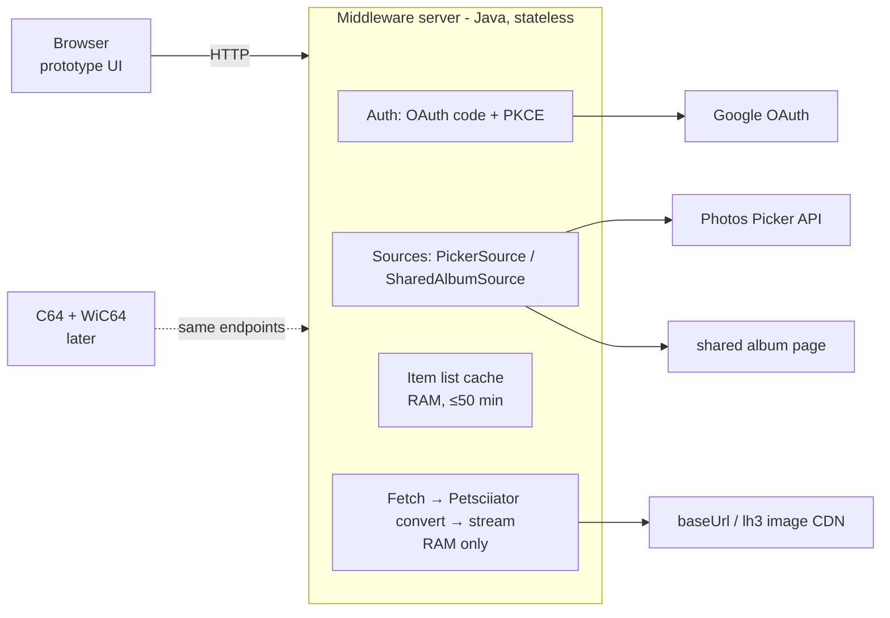

# Plan: Web-only Google Photos Prototype (stateless middleware)

*Status: plan · Date: 2026-09-30 · Companion to [google-photos-feasibility.md](google-photos-feasibility.md)*

## 1. Goal

A browser-only prototype, with **no C64 needed yet**, that:

1. signs in with Google,
2. lets you choose photos (Picker) **or** open an album (shared-album link),
3. shows them in the browser, both as the original and as the **C64 rendering** (the exact Koala/Hi-Eddi bytes the C64 will get, drawn as a PNG),
4. **stores no images anywhere.** The server is pure middleware: fetch from Google → (convert) → stream to the client.

The same server endpoints later serve the C64, so the prototype becomes the real backend.

## 2. What "no images in the middle" means (and what it costs)

The server keeps **no image files and no image database**. Every request fetches the photo from Google, converts it in memory and streams it out. Only short-lived **RAM** caches are allowed (item list ≤ 50 min, a few converted images for prev/next). They disappear on restart.

The state doesn't vanish, though; it moves from *images* to *credentials*:

| Needed to re-fetch a photo later | Why | Kept where |
|---|---|---|
| OAuth access token (1 h) + refresh token | Every `baseUrl` request needs `Authorization: Bearer` | Server memory (prototype); encrypted file later if it must survive restarts |
| Picker session id | `mediaItems.list` issues fresh `baseUrl`s (valid 60 min) only while the session lives | Same |
| Shared-album link | Re-read the album page for fresh image URLs | Same (the link itself is the secret) |

**Hard limits this runs into:**

| Source | How long a selection keeps working with no stored images | Consequence |
|---|---|---|
| **Picker** | Until the Picker session's `expireTime`, reportedly **~7 days** after creation (one third-party data point; confirm in step 0). Refresh tokens of Testing-mode or unverified apps also expire after 7 days. | Photos disappear after about a week, **so you'd re-pick weekly.** OK for a prototype; annoying for a permanent C64 frame. |
| **Shared-album link** | **Indefinitely**, while the album stays shared. New photos in the album show up automatically. | Pure middleware works long-term. Unofficial, so it can break when Google changes the page. |
| Ambient API (partner-only) | Indefinitely; built for exactly this | Not available unless accepted. |

**Recommendation:** build both sources in the prototype. It will show quickly whether "weekly re-pick" is acceptable or whether the shared-album source (or, as a fallback, storing converted images after all) is needed for the C64 frame.

## 3. Architecture

### Per-request flow ("show photo i as C64")

1. Look up the source's item list in RAM. If it's missing or older than 50 min, re-list (`mediaItems.list` with a refreshed token, or re-parse the album page).
2. `GET <baseUrl>=w640-h400` (+ Bearer for Picker). The response goes into a byte array, not a file.
3. Convert with Petsciiator (`KoalaConverter` / `HiEddiConverter`). The current API takes file paths, so use a temp file that's deleted immediately (or `/dev/shm`), or add a stream-based overload in Petsciiator later.
4. Respond with raw `.koa` bytes (for the C64) or a PNG rendering of them (for the browser).

**Latency:** ~0.3 s download + ~0.3–1 s conversion. The browser preloads the next photo; the C64 client will do the same with its hidden VIC buffer.

## 4. Endpoints

| Endpoint | Purpose |
|---|---|
| `GET /` | Start page: "Sign in with Google" · "Open shared album link" |
| `GET /auth/login` → `GET /auth/callback` | OAuth 2.0 auth-code + PKCE, scope `photospicker.mediaitems.readonly`, `access_type=offline` |
| `POST /picker/session` | `sessions.create` → return `pickerUri` + `/autoclose`; the UI opens it in a new tab |
| `GET /picker/status` | `sessions.get` (respecting `pollingConfig`) → `{ready: bool}` |
| `POST /album` | Register a shared-album link (`photos.app.goo.gl/…`) as a source |
| `GET /api/items?src=…` | JSON list: index, filename, createTime, width, height (**no** Google URLs to the client) |
| `GET /img/{src}/{i}?v=orig&w=800` | Proxied original (resized by Google), streamed |
| `GET /img/{src}/{i}?v=c64&mode=mc\|hi&dither=0..100&ar=0\|1` | C64 rendering as PNG (Koala/Hi-Eddi decoded with the VIC-II palette, double-width pixels in multicolor) |
| `GET /img/{src}/{i}.koa?…` | The exact bytes the C64 will receive (for byte-level tests and a VICE check) |
| `GET /c64?…` | *Later:* the C64 wire protocol from the study §6.3, built on the same functions |

The web UI is plain HTML + a little JS, served by the same server:
* a thumbnail grid;
* a large view with **original | C64** side by side;
* slideshow (interval, prev/next, keyboard);
* toggles for multicolor/hires, dither and aspect, the same options the C64 client will have;
* "Pick more" (a new Picker session; lists are merged in RAM) and a "session expires in N days" hint.

## 5. Technology

* **Java, in this repository**, reusing Petsciiator and Jackson (already dependencies). No Google client library is needed: `java.net.http.HttpClient` for the REST calls.
* New package `com.sixtyfour.gphotos` with servlets. Run locally with `mvn jetty:run` (Jetty 9.4 plugin, matches `javax.servlet` 3.1). The existing `ImageViewer` servlet stays untouched.
* **Local-first:** Google allows `http://localhost` redirect URIs for development, so the prototype needs **no domain and no hosting**. That fits "hosting not decided". A public HTTPS domain only becomes necessary for the QR-from-phone flow (Google rejects private IPs and `.local` in redirect URIs) and for a C64 outside your LAN. A WiC64 on the same LAN can already reach `http://<pc-ip>:8080` for early C64 tests.
* Config through environment variables: `GOOGLE_CLIENT_ID`, `GOOGLE_CLIENT_SECRET`, `PUBLIC_BASE_URL`.

## 6. Steps and effort

| Step | Content | Days | Done when |
|---|---|---|---|
| 0 | Google Cloud project, Picker API enabled, OAuth consent in Testing, you as test user; one manual session via curl. **Answer the open questions (§7).** | 0.5–1 | A `baseUrl` downloads with your token |
| 1 | Server skeleton, `jetty:run`, OAuth code + PKCE, tokens in RAM, auto refresh | 1 | "Signed in as …" page |
| 2 | Picker flow: create session, open `pickerUri/autoclose`, poll, list items; item-list cache with re-list after 50 min | 1 | Picked photos listed in the browser |
| 3 | Streaming proxy for originals (no disk) + thumbnail grid + large view + slideshow | 1 | Photos browse smoothly |
| 4 | C64 rendering: convert in memory, Koala/Hi-Eddi → PNG renderer, `.koa` download, mode/dither/aspect toggles | 1–1.5 | Side-by-side original vs C64 view; `.koa` opens in VICE |
| 5 | `SharedAlbumSource`: parse the album page (pattern-based), continuation for >300 items, same endpoints | 1–1.5 | A shared album works without sign-in and shows newly added photos |
| **Total** | | **5.5–7** | |

After the prototype, the C64 path is: add `/c64` (wire protocol from the study §6.3), then point the existing BASIC client at it for a first test (Phase 1 of the study), then the Oscar64 client.

## 7. Questions the prototype must answer

1. **Picker session lifetime:** what `expireTime` do real sessions get, and do `mediaItems.list` calls return fresh `baseUrl`s for the whole lifetime?
2. **Refresh token lifetime** for Testing mode vs "In production (unverified)". Sources disagree; measure it.
3. **Favorites in the picker:** does searching "favorites" work? Can whole days or albums be selected at once? Are item ids stable across sessions?
4. **Shared albums:** parsing robustness, and how many items before continuation is needed.
5. **On-the-fly conversion time** per photo on your hardware, and whether preloading hides it.
6. **Is weekly re-picking acceptable** for the C64 use case, or does the frame need the shared-album source / stored conversions?

## 8. Security (prototype level)

* Only your Google account (a Testing-mode test user).
* Tokens live only in server RAM, keyed by an HttpOnly session cookie. Nothing is written to disk.
* The server never sends Google `baseUrl`s or album-page URLs to the browser: clients only see `/img/{src}/{i}`.
* It binds to `localhost` by default, and to the LAN only when you explicitly enable it for C64 tests.
