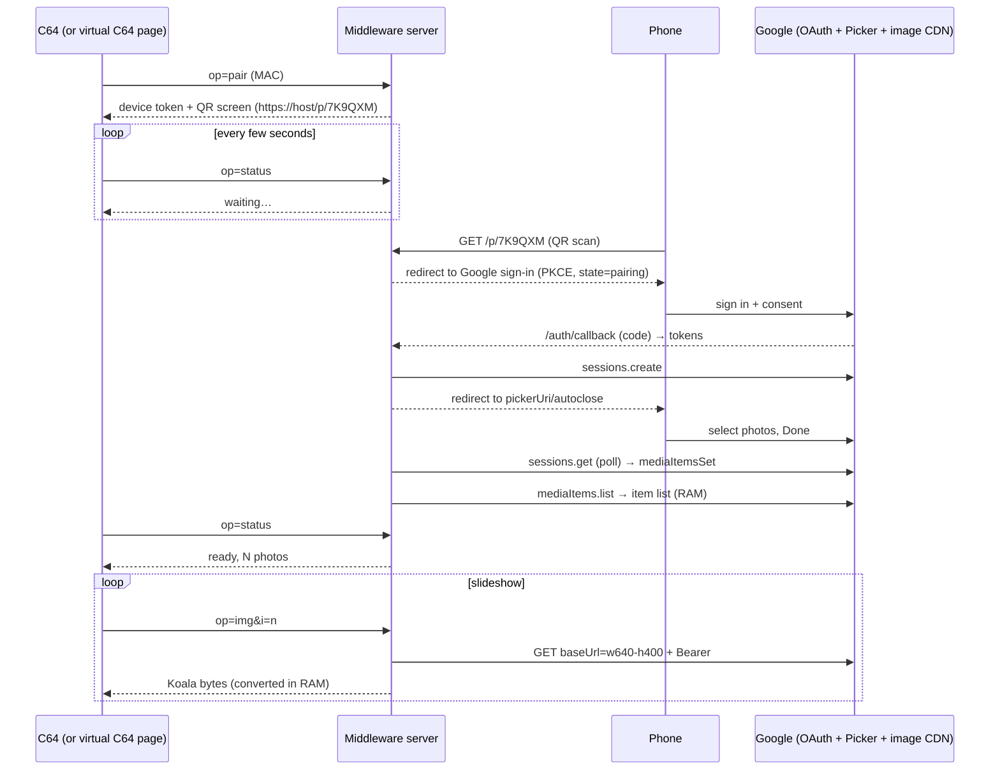

# Plan: Web-only Google Photos Prototype (stateless middleware)

*Status: plan · Date: 2026-09-30 · Companion to [google-photos-feasibility.md](google-photos-feasibility.md)*

## 1. Target flow (the product)

1. **Start the app on the C64.** It contacts our backend, which starts a pairing and returns a screen with a **QR code**.
2. **Scan the QR code with a phone.** It opens our backend, which sends you to Google sign-in and then into the **Google Photos Picker**, where you select the photos you want to share.
3. **The C64 is now authorised** (it polls the backend) and **starts the slideshow.**

Only Google's official Picker API is used. **Shared-album links are out of scope** (decision 8).

## 2. Goal of the prototype

Test exactly that flow **before any C64 code exists**, with a browser page that plays the C64's part:

* A **"virtual C64" page** (on your PC) starts a pairing and shows the QR code, the same bitmap the C64 will show.
* You scan it with your phone → Google sign-in → Picker → select → done.
* The virtual C64 page notices and starts a slideshow of **C64 renderings** (the exact Koala/Hi-Eddi bytes the C64 will get, drawn as a PNG), with the original next to it and the same toggles (multicolor/hires, dither, aspect).
* **No images are stored.** The server is pure middleware: fetch from Google → convert → stream.

The virtual C64 page uses the same backend endpoints the real C64 will call, so the prototype *is* the backend.

## 3. How the flow works behind the scenes

## 4. What "no images in the middle" means

The server keeps **no image files and no image database**. Each request fetches the photo from Google, converts it in memory and streams it out. Only short-lived **RAM** caches are used (item list ≤ 50 min, a few converted images for prev/next), and they disappear on restart.

To fetch a photo *again later*, the server must keep **credentials instead of images**: the OAuth refresh token and the Picker session id, linked to the device token. That's the minimum state for this design.

### Limit 1: a selection only lives as long as its Picker session

| Item | Lifetime | Effect on the C64 |
|---|---|---|
| Image link (`baseUrl`) | 60 min | None: the server re-lists silently |
| Access token | 1 h | None: refreshed silently |
| **Picker session** | Until its `expireTime`, reportedly **~7 days** (one third-party data point; measured in step 0) | After that the photos can't be fetched any more. **The C64 automatically shows a new QR code**, and you scan and pick again. |
| Refresh token (Testing mode / unverified app) | 7 days | Same window, so no extra effect |

With pure middleware, **a C64 running for weeks needs a re-scan about once a week.** Because the phone usually stays signed in to Google, a re-scan is QR → confirm → pick. See §8 for ways around it if that turns out to be too often.

### Limit 2: you select photos, not folders

The Picker returns individual photos, never a folder. It has no Favorites or Albums tabs. To share "a folder", search the album name in the picker and select its photos (to be tested: select-all / select-by-day). New photos added to that album later are not picked up automatically.

## 5. Endpoints

| Endpoint | Caller | Purpose |
|---|---|---|
| `GET /c64?op=pair&mac=…` | C64 / virtual C64 | New pairing: device token + pairing code; QR screen as `.koa` or PNG |
| `GET /c64?op=status&t=…` | C64 / virtual C64 | waiting / picking / ready (N photos) / expired (show QR again) |
| `GET /c64?op=img&t=…&i=n&mode=mc\|hi&dither=0..100&ar=0\|1` | C64 | Koala/Hi-Eddi bytes, converted in RAM |
| `GET /c64?op=info&t=…&i=n` | C64 | Date, file name, position |
| `GET /p/{code}` | Phone (QR) | Validates the code → Google sign-in (auth-code + PKCE, `state` bound to the device) |
| `GET /auth/callback` | Google → phone | Code → tokens, `sessions.create`, redirect to `pickerUri` + `/autoclose` |
| `GET /virtual` | Browser | The virtual C64 page: shows the QR, polls status, runs the slideshow using `op=img` rendered as PNG (+ original side by side) |
| `GET /img/{i}.png?v=orig\|c64&…&t=…` | Virtual C64 page | PNG versions for the browser; no Google URLs ever reach a client |

The wire format for `/c64` is the one from the study §6.3.

## 6. Technology and hosting

* **Java, in this repository**, reusing Petsciiator (conversion) and Jackson. `java.net.http.HttpClient` handles the Google REST calls, so no Google client library is needed.
* New package `com.sixtyfour.gphotos`, run with `mvn jetty:run` (Jetty 9.4, matches `javax.servlet` 3.1). The existing `ImageViewer` servlet stays untouched.
* **The phone must reach the server over HTTPS on a public host name.** Google rejects `localhost`, private IPs and `.local` as redirect targets for a phone. For the prototype that doesn't mean real hosting: run the server on your PC and expose it through a **tunnel** (e.g. Cloudflare Tunnel or ngrok, which give an HTTPS URL). Register that URL as the OAuth redirect. The final hosting decision can wait.
* The WiC64 can later use the same tunnel URL, or `http://<pc-ip>:8080` on your LAN.
* Config via environment variables: `GOOGLE_CLIENT_ID`, `GOOGLE_CLIENT_SECRET`, `PUBLIC_BASE_URL`.

## 7. Steps and effort

| Step | Content | Days | Done when |
|---|---|---|---|
| 0 | Google Cloud project, Picker API enabled, OAuth consent in Testing, you as test user, tunnel URL as redirect; one manual session via curl. **Measure the open questions (§9).** | 0.5–1 | A `baseUrl` downloads with your token |
| 1 | Server skeleton, `jetty:run`, pairing codes + device tokens (RAM), `/p/{code}` → OAuth code + PKCE, token refresh | 1 | Scanning a code on the phone ends in "signed in as …" |
| 2 | Picker: `sessions.create` → redirect to `pickerUri/autoclose`, poll `sessions.get`, `mediaItems.list`; item-list cache with re-list after 50 min; `op=status` | 1 | The phone picks, and the status turns "ready, N photos" |
| 3 | `op=img`: fetch with Bearer → convert in RAM → Koala/Hi-Eddi bytes; PNG renderer (VIC-II palette); original proxy | 1–1.5 | `.koa` opens in VICE; PNG looks identical |
| 4 | Virtual C64 page: QR screen (ZXing), status polling, slideshow, toggles, "expired → new QR" handling | 1 | The full flow of §1 works end to end in the browser + phone |
| **Total** | | **4.5–5.5** | |

Next after the prototype: point a real C64 at `/c64`. First the existing BASIC client for a smoke test, then the Oscar64 client (study §7).

## 8. If weekly re-scanning is too often

To be decided after the prototype has measured the real lifetimes:

| Option | Stores | Re-scan needed | Notes |
|---|---|---|---|
| **A. Pure middleware** (this plan) | Credentials only | ~weekly | Simplest; fully honours "nothing in the middle" |
| **B. Cache on the C64's own disk** | Converted images **on your C64's drive** (SD2IEC / 1541), nothing on the server | Only to add photos | While the session is valid, the C64 downloads each picked photo once and saves it as a Koala file (the save feature already exists). Afterwards it plays offline indefinitely. A 1541 side holds ~16 Koala images (40 blocks each); SD2IEC holds thousands. Saving takes ~20–30 s per image at KERNAL speed, but downloading can run in the background over days while the slideshow plays. |
| **C. Keep converted C64 images on the server** | 10 KB lossy 160×200 renditions only, never originals | Only to add photos | A compromise if B is too slow or you don't have an SD2IEC |

## 9. Questions the prototype must answer

1. **Picker session lifetime:** what `expireTime` do real sessions get, and does `mediaItems.list` return fresh `baseUrl`s for the whole lifetime?
2. **Refresh token lifetime** in Testing mode (expected 7 days).
3. **Selecting "a folder":** does searching an album name work, and can many photos or whole days be selected quickly? Does searching "favorites" work?
4. **On-the-fly conversion time** per photo, and whether preloading the next photo hides it.
5. **Is the ~weekly re-scan acceptable** (option A), or do we go with B or C?

## 10. Security (prototype level)

* Only your Google account (Testing-mode test user).
* Pairing codes are single-use and valid for 10 minutes. Device tokens are 128-bit random values.
* Tokens and session ids live only in server RAM, so a server restart means re-pairing (a persisted, encrypted store comes later if needed).
* The server never gives Google URLs to any client, only `/c64` and `/img` responses.
* The tunnel exposes only the prototype's endpoints.
